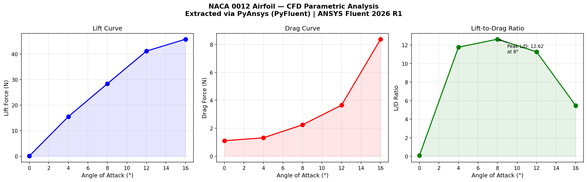

# NACA 0012 Airfoil CFD Automation Pipeline
### Automated parametric CFD post-processing using PyAnsys (PyFluent) + Python

---

## Overview
This project demonstrates end-to-end automation of a Computational Fluid Dynamics (CFD) workflow for a NACA 0012 airfoil using ANSYS Fluent 2026 R1 and the PyAnsys (PyFluent) Python library. Rather than manually extracting results through the GUI, the pipeline programmatically connects to Fluent, loads solved case files, computes aerodynamic forces, and generates visualization reports with zero manual post-processing steps.

---

## Skills Showcased
| Skill | Tool |
|---|---|
| CFD simulation setup and solving | ANSYS Fluent 2026 R1 |
| Parametric geometry and meshing | ANSYS Workbench + DesignModeler |
| Python automation of CFD workflows | PyAnsys (PyFluent 0.39) |
| Programmatic force extraction | PyFluent report definitions API |
| Data processing and analysis | Python (Pandas, NumPy) |
| Automated visualization | Matplotlib |
| Version control and documentation | GitHub |

---

## Simulation Setup
- **Airfoil:** NACA 0012 (imported from GrabCAD as SolidWorks part)
- **Solver:** ANSYS Fluent 2026 R1 — 2D, pressure-based, steady-state
- **Mesh:** Unstructured triangular mesh — 134,396 cells, 68,126 nodes
- **Boundary conditions:** Velocity inlet, pressure outlet, no-slip wall
- **Parametric sweep:** Angle of attack — 0, 4, 8, 12, 16 degrees
- **Iterations per design point:** 500

---

## Automation Pipeline
The Python notebook (airfoil_postprocess.ipynb) does the following entirely programmatically:

1. Launches an ANSYS Fluent solver session via PyFluent
2. Loops through 5 design point folders (one per angle of attack)
3. Loads each solved .cas.h5 and .dat.h5 file into Fluent
4. Creates lift and drag report definitions via the PyFluent API
5. Extracts aerodynamic forces programmatically
6. Builds a structured Pandas DataFrame from results
7. Exports results to CSV
8. Generates a 3-panel visualization report saved as PNG
9. Closes the Fluent session cleanly

---

## Results

| Angle (degrees) | Lift (N) | Drag (N) | L/D Ratio |
|---|---|---|---|
| 0 | 0.098 | 1.112 | 0.088 |
| 4 | 15.526 | 1.320 | 11.763 |
| 8 | 28.413 | 2.251 | 12.625 |
| 12 | 41.150 | 3.655 | 11.259 |
| 16 | 45.799 | 8.372 | 5.471 |

**Key finding:** Peak aerodynamic efficiency (L/D = 12.62) occurs at 8 degrees angle of attack. Beyond this point, drag increases sharply as flow separation develops on the upper surface, consistent with classical NACA 0012 behavior.

---

## How to Run

### Prerequisites
Install the required Python packages by running the following command in your terminal:

pip install ansys-fluent-core pandas matplotlib numpy

- ansys-fluent-core: PyAnsys library for programmatic Fluent control
- pandas: data manipulation and CSV export
- matplotlib: automated plot generation
- numpy: numerical computations

### Requirements
- ANSYS Fluent 2026 R1 (student or commercial license)
- Python 3.11+
- Solved Workbench project with retained design point data

### Steps
1. Clone this repository
2. Open airfoil_postprocess.ipynb in Jupyter
3. Update base_path to point to your ANSYS project folder
4. Run all cells

---

## Project Context
Built as a portfolio project targeting CFD automation and simulation tooling roles. Demonstrates the ability to replace manual GUI-based post-processing with scalable, reproducible Python pipelines, the core skill required for engineering software development and simulation automation.

---

## Tools and Versions
- ANSYS Fluent 2026 R1 (Student)
- PyFluent 0.39.dev0
- Python 3.11
- Pandas, Matplotlib, NumPy
- Jupyter Notebook
- GitHub
