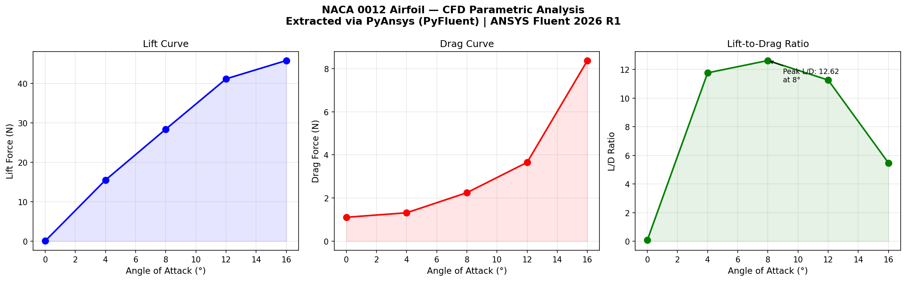

# NACA 0012 Airfoil CFD Automation Pipeline

### Programmatic control of ANSYS Fluent with PyAnsys (PyFluent) + Python

---

## Overview

This project replaces manual, GUI-based CFD post-processing with a scripted Python pipeline. Using PyAnsys (PyFluent), the notebook launches a Fluent session, loads a series of solved case files across an angle-of-attack sweep, builds lift and drag report definitions through the settings API, extracts forces programmatically, and produces a CSV and figure with no GUI interaction.

The subject of this project is the **automation layer**. The airfoil sweep is the payload.

---

## Simulation Setup

Steady-state 2D RANS of a NACA 0012 airfoil across a five-point angle-of-attack sweep (0°, 4°, 8°, 12°, 16°). Angle of attack is set by rotating the airfoil geometry in DesignModeler and re-meshing per design point; freestream direction is held fixed.

| Parameter | Value |
|---|---|
| Solver | Pressure-based, steady-state, 2D (SI units) |
| Turbulence model | k-ω SST, fully turbulent (no transition model) |
| Fluid | Air, constant properties (incompressible) |
| Density | 1.225 kg/m³ |
| Dynamic viscosity | 1.7894 × 10⁻⁵ kg/(m·s) |
| Freestream velocity | 3 m/s, direction (1, 0) |
| Chord | 1.0 m |
| **Reynolds number** | **≈ 2.1 × 10⁵** |
| Mesh | Unstructured triangular, regenerated per design point (~73k cells at 12°) |
| Convergence | Scaled residuals to ~1 × 10⁻⁴ |

Because the airfoil is rotated in geometry while the freestream direction stays fixed at (1, 0), lift and drag are correctly recovered as the force components perpendicular and parallel to the freestream.

---

## Skills Demonstrated

| Skill | Tool |
|---|---|
| Programmatic solver control | PyAnsys (PyFluent) |
| Report definition API / force extraction | PyFluent `report_definitions` |
| Batch processing across design points | Python |
| Data structuring and export | Pandas, NumPy |
| Automated figure generation | Matplotlib |
| Version control and documentation | Git / GitHub |

CFD setup, parametric geometry, and meshing were performed in ANSYS Workbench and DesignModeler prior to this pipeline.

---

## Pipeline

`airfoil_postprocess.ipynb` executes the following without manual intervention:

1. Launches an ANSYS Fluent solver session via PyFluent (2D, double precision)
2. Iterates over five design point folders, one per angle of attack
3. Reads each solved `.cas.h5` / `.dat.h5` into the session
4. Creates lift and drag report definitions through the settings API
5. Computes and extracts the force values programmatically
6. Assembles a structured Pandas DataFrame
7. Exports to CSV
8. Generates a three-panel Matplotlib figure
9. Closes the session cleanly

Adding a design point requires adding one dictionary entry.

---

## Results

Sweep: NACA 0012, 0–16° angle of attack, Re ≈ 2.1 × 10⁵.

| Angle (deg) | Lift (N) | Drag (N) | L/D |
|---|---|---|---|
| 0 | 0.098 | 1.112 | 0.088 |
| 4 | 15.526 | 1.320 | 11.763 |
| 8 | 28.413 | 2.251 | 12.625 |
| 12 | 41.150 | 3.655 | 11.259 |
| 16 | 45.799 | 8.372 | 5.471 |



Near-zero lift at 0° is the expected result for a symmetric section and confirms the force extraction is wired correctly. Peak lift-to-drag occurs near 8°, and the sharp L/D drop and drag rise by 16° are consistent with the onset of stall.

**On the magnitude of L/D:** peak L/D here is ~12.6, well below the values quoted for NACA 0012 in classic references (Abbott & von Doenhoff), but those data are at Re ≈ 3–9 × 10⁶. This simulation runs at Re ≈ 2 × 10⁵ — one to two orders of magnitude lower — with a fully-turbulent SST model. A fully-turbulent boundary layer from the leading edge over-predicts skin-friction drag at this Reynolds number, where a real airfoil retains a substantial laminar run. The results are therefore internally consistent and physically reasonable for this regime, while conservative on L/D.

---

## Limitations

- **No transition model.** The boundary layer is treated as fully turbulent from the leading edge. At Re ≈ 2 × 10⁵ this over-predicts drag and depresses L/D relative to a transition-resolved run.
- **Near-wall resolution varies.** The mesh is unstructured triangular without formal inflation layers. Estimated median y+ on the airfoil is ~2 (usable for SST), but first-cell spacing varies across the surface, so wall resolution is not uniform.
- **Not validated against experiment.** Coefficients were not compared point-by-point against published data; the discussion above is a regime argument, not a formal validation.
- **Freestream velocity verified for one design point.** The 3 m/s freestream was read from the archived 12° case. The sweep holds velocity constant and varies geometry angle; the other four points were assumed to share the same freestream rather than individually re-read.

---

## How to Run

```
pip install ansys-fluent-core pandas matplotlib numpy
```

Requires ANSYS Fluent 2026 R1 (student or commercial), Python 3.11+, and a solved Workbench project with retained design point data.

1. Clone the repository
2. Open `airfoil_postprocess.ipynb`
3. Point `base_path` at your ANSYS project folder
4. Run all cells

---

## Environment

ANSYS Fluent 2026 R1 (Student) · PyFluent · Python 3.11 · Pandas · Matplotlib · NumPy · Jupyter
